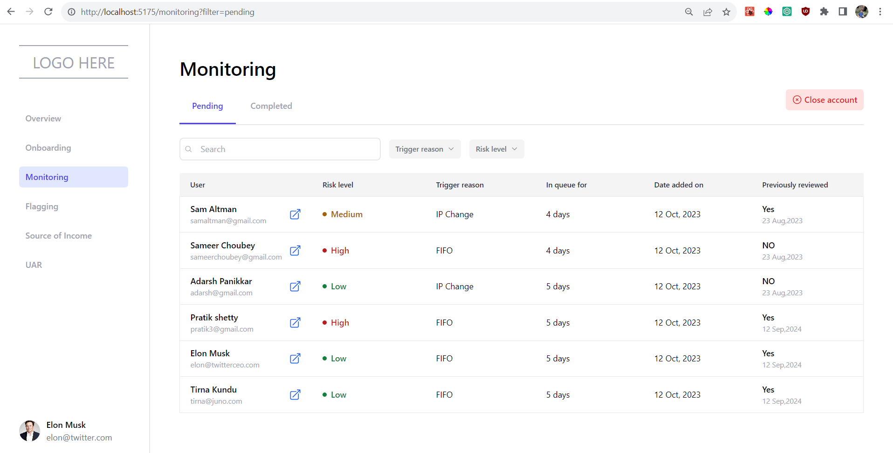
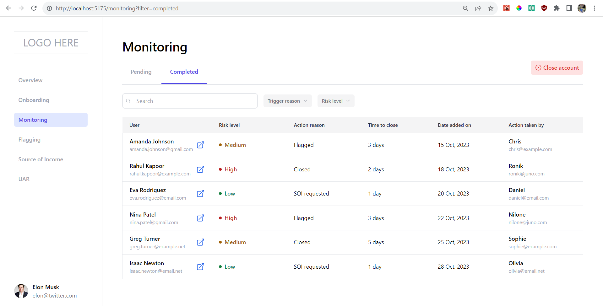
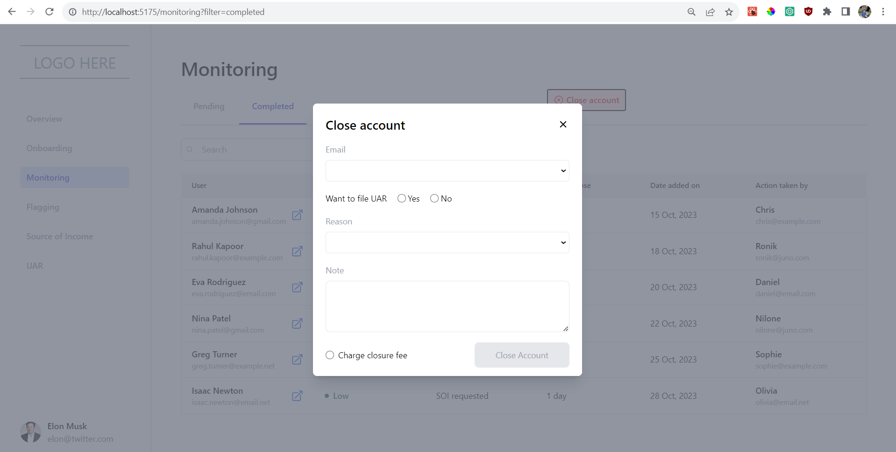

# Juno Finance Pages | React + Vite Project 👨‍💻

##Web Assignment

Simple dashboard showing all the users currently in the monitoring queue who need to be reviewed for risky behaviour

## Monitoring | Pending Users 🔍

## Monitoring | Completed Users ✅

## Close Account Modal 🚫

---

#### 💡What were my learning?

- How to make a `BaseTable` re-usable component. 📋

  - With configurable columns.
  - Custom cell templating.
  - Custom filtering on cell heading.

- How to use react router's query params. ❓

  - Used query param `?filter` to understand the default tab rendering.
  - Constionally redering of `Pending` & `Completed` tabs.

- How to make `BaseModal` dedicated component to implement the close account functionality. 🤔
